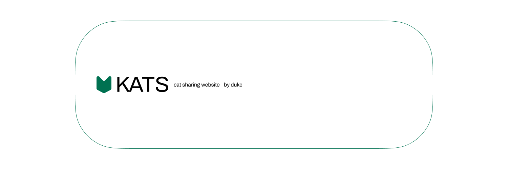

# kats

A cat sharing website. You'll be able to submit your cat to be featured in a vote at the end of every month, there will be prelims, semifinals, and finals, which will be your cats competing to be the Cat of the Month! Winners will have an award certificate designed for them, and they'll be shared around everywhere.

The app will be built with Next.js, the design is meant to be kind of simple, kind of inconsistent on purpose, like it's not meant to be perfect.
